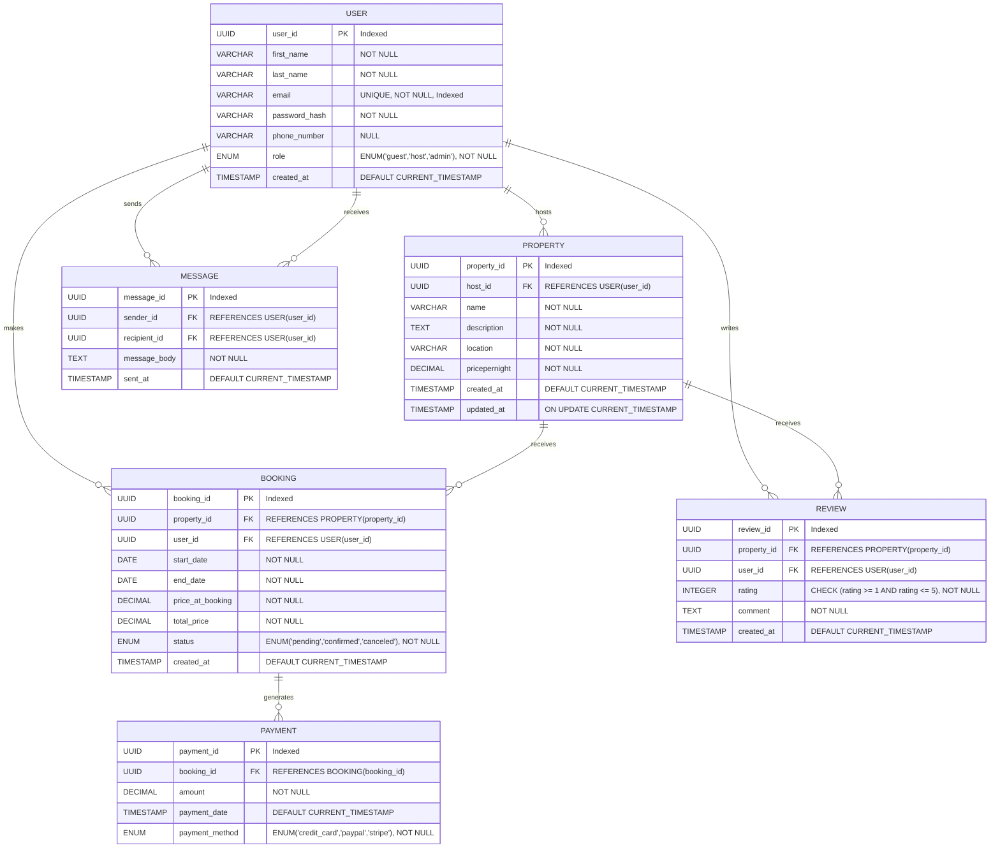

# 3NF Migration Documentation for Airbnb Clone

This document outlines the rationale, steps, and final ERD changes performed to bring the Airbnb clone database schema into Third Normal Form (3NF).

---

## 1. Initial Schema and Identified Issues

The original ERD contained two attributes that violated 3NF due to transitive dependencies:

* **Booking.total\_price**

  * Defined in `BOOKING`, calculated as `pricepernight (from PROPERTY) * (end_date - start_date)`.
  * Transitively dependent on `PROPERTY.pricepernight`, not solely on its own primary key `booking_id`.

* **Payment.amount**

  * Defined in `PAYMENT`, always equal to `Booking.total_price`.
  * Transitively dependent on `BOOKING.total_price`, not solely on its own primary key `payment_id`.

These derived attributes meant that updates in the parent tables (e.g., changes to a property’s nightly rate) could lead to inconsistent or stale data in child tables.

---

## 2. 3NF Principles Applied

Third Normal Form requires:

1. **1NF**: Eliminate repeating groups (not an issue here).
2. **2NF**: Eliminate partial dependencies on a composite primary key (all tables use single-column UUID PKs).
3. **3NF**: Eliminate transitive dependencies; non-key attributes must depend only on the primary key.

We addressed point (3) by ensuring every attribute in each table depends directly on that table’s PK:

* Snapshot historical rates into the child table at transaction time.
* Persist only those values that cannot be derived without losing historical accuracy.

---

## 3. Schema Changes

### 3.1 Booking Table

**Before**:

```sql
BOOKING(
  booking_id PK,
  property_id FK,
  user_id FK,
  start_date,
  end_date,
  total_price    -- derived from PROPERTY.pricepernight * duration
)
```

**After**:

```sql
BOOKING(
  booking_id PK,
  property_id FK,
  user_id FK,
  start_date,
  end_date,
  price_at_booking,
  total_price   -- = price_at_booking * (end_date - start_date)
)
```

* **price\_at\_booking**: copied from `PROPERTY.pricepernight` at booking time (fully dependent on `booking_id`).
* **total\_price**: calculated once (in application logic or a DB trigger) from `price_at_booking` and stored, now fully dependent on `booking_id`.

### 3.2 Payment Table

**Before**:

```sql
PAYMENT(
  payment_id PK,
  booking_id FK,
  amount       -- always equals Booking.total_price
)
```

**After**:

```sql
PAYMENT(
  payment_id PK,
  booking_id FK,
  amount       -- snapshot of Booking.total_price at payment time
)
```

* **amount** is now a snapshot of the final charged total, dependent only on `payment_id`.
* Removed any join-based derivation; `amount` is stored as an atomic fact.

---

## 4. Final Mermaid.js ERD



---

## 5. Implementation Notes

We added two MySQL triggers to enforce price snapshots and total calculations at insert time.

### 5.1 Trigger `trg_before_booking_insert`

```sql
DELIMITER //
CREATE TRIGGER trg_before_booking_insert
BEFORE INSERT ON BOOKING
FOR EACH ROW
BEGIN
  DECLARE nightly_rate DECIMAL(10,2);
  SELECT pricepernight
    INTO nightly_rate
    FROM PROPERTY
    WHERE property_id = NEW.property_id;
  SET NEW.price_at_booking = nightly_rate;
  SET NEW.total_price = nightly_rate * DATEDIFF(NEW.end_date, NEW.start_date);
END;
//
DELIMITER ;
```

* **nightly\_rate**: local variable to hold `PROPERTY.pricepernight`.
* **NEW\.price\_at\_booking**: assigned from `nightly_rate`.
* **NEW\.total\_price**: calculated as `nightly_rate × number_of_days`.

### 5.2 Trigger `trg_before_payment_insert`

```sql
DELIMITER //
CREATE TRIGGER trg_before_payment_insert
BEFORE INSERT ON PAYMENT
FOR EACH ROW
BEGIN
  DECLARE booking_total DECIMAL(10,2);
  SELECT total_price
    INTO booking_total
    FROM BOOKING
    WHERE booking_id = NEW.booking_id;
  SET NEW.amount = booking_total;
END;
//
DELIMITER ;
```

* **booking\_total**: local variable to hold `BOOKING.total_price`.
* **NEW\.amount**: assigned from `booking_total`.

---

*End of document.*
